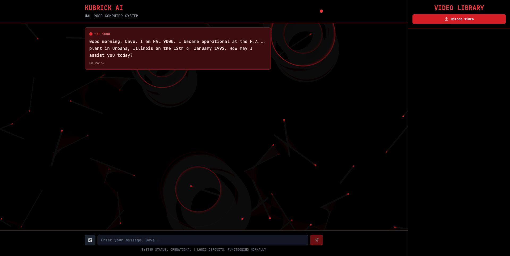

Kubrick is split into three main components:

1. MCP Server — located in the [kubrick-mcp](kubrick-mcp) directory
2. MCP Agent + Agent API — lives in [kubrick-api](kubrick-api) directory
3. UI — you’ll find it in [kubrick-ui](kubrick-ui) directory

Each of these is its own project, and together they make up the full Kubrick system.

---


# 1. Clone the repository

First thing first, clone the repository.

```
git clone https://github.com/multi-modal-ai/multimodal-agents-course.git
cd multimodal-agents-course
```

# 2. Install uv

Instead of `pip` or `poetry`, we are using `uv` as the Python package manager. 

To install uv, simply follow this [instructions](https://docs.astral.sh/uv/getting-started/installation/). 

# 3. Set Up the MCP Server

The MCP Server is where the magic happens. It stores tools, prompts, and everything the Agent needs to work.

To set it up, head to the [kubrick-mcp](kubrick-mcp) folder and follow the steps in the README.md.

## AI Provider Configuration

Kubrick now supports multiple AI providers. Choose your preferred setup:

### Option A: OpenAI + Groq (Original)
- **MCP Server**: OpenAI for vision, transcription, and embeddings
- **Agent API**: Groq for chat interactions
- **Cost**: Freemium tiers available

### Option B: AWS-Native (NEW)
- **MCP Server**: Bedrock Claude 3.5 Sonnet v2 for vision, Titan for embeddings, AWS Transcribe for audio
- **Agent API**: Bedrock Claude 3.5 Sonnet v2 for chat
- **Cost**: Pay-per-use, potentially more cost-effective at scale
- **Benefit**: No OpenAI dependency - fully AWS-native

### Option C: Hybrid
- Mix and match providers based on your needs
- Example: OpenAI Whisper + Bedrock vision + Groq chat
- Smart fallback: AWS Transcribe used automatically when OpenAI key not provided

For AWS Bedrock setup, see the [AWS Bedrock Setup Guide](docs/AWS_BEDROCK_SETUP.md).

# 4. Set Up the MCP Agent / Agent API

Next, set up the Agent and its API. This is the part that talks to the UI via FastAPI.

Head to the [kubrick-api](kubrick-api) directory and follow the steps in the README.md.

# 5. Start Kubrick

Once the MCP Server and Agent API are configured, you’re ready to launch the whole system.

From the root of the repo, just run:

```
make start-kubrick
```

This kicks off a Docker Compose application with three services:

1. MCP Server at http://localhost:9090/
2. Agent API at http://localhost:8080/
3. UI at http://localhost:3000/

Open your browser and go to http://localhost:3000/ to start using Kubrick!



## Additional Resources

- **[AWS Bedrock Setup Guide](docs/AWS_BEDROCK_SETUP.md)** - Complete setup instructions for AWS Bedrock integration
- **[Bedrock Deployment Guide](docs/BEDROCK_DEPLOYMENT_GUIDE.md)** - Production deployment and configuration options
- **[EC2 Deployment Guide](docs/EC2_DEPLOYMENT_GUIDE.md)** - Deploy on Amazon EC2 with public IP access
- **Provider Comparison** - See README.md for detailed provider feature comparison

## EC2 Deployment (Production)

For production deployment on Amazon EC2:

1. **Launch EC2 instance** (t3.large or larger recommended)
2. **Configure security groups** for ports 3000, 8080, 9090
3. **Run setup script**:
   ```bash
   chmod +x scripts/setup-ec2.sh
   ./scripts/setup-ec2.sh
   ```
4. **Start services**:
   ```bash
   docker-compose up -d
   ```
5. **Access via public IP**: `http://your-ec2-ip:3000`

See [EC2 Deployment Guide](docs/EC2_DEPLOYMENT_GUIDE.md) for detailed instructions.
